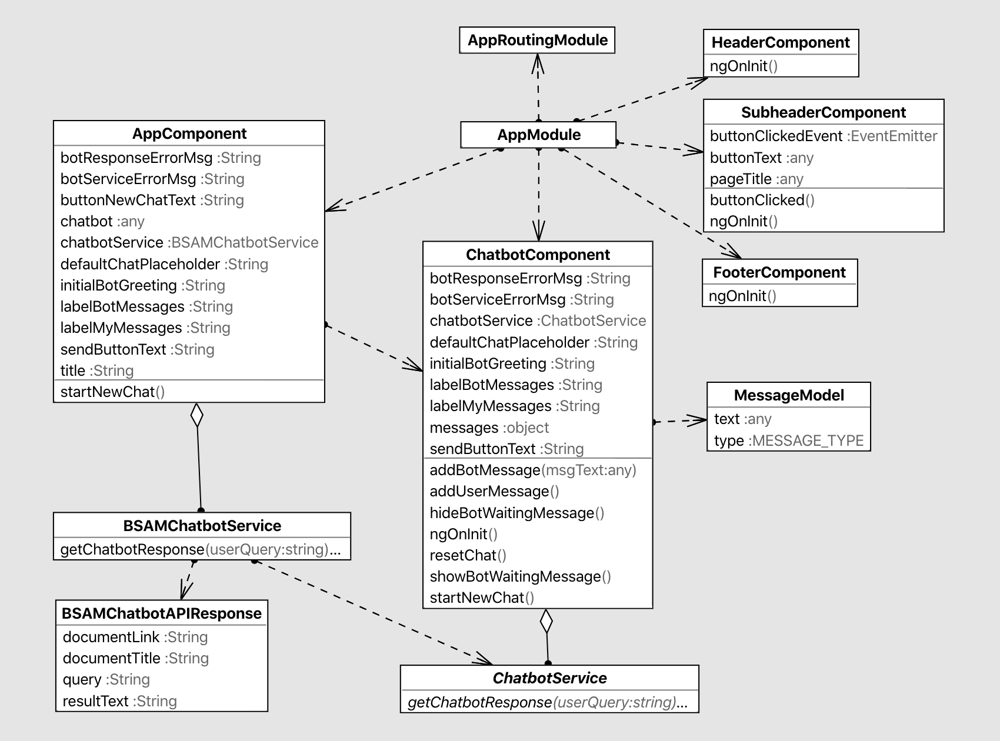

# beta.SAM Chatbot

## Code Modularity

To **modularize** the code the Angular project is organized into the following components:
* header
* subheader
* chatbot
* footer

### Chatbot Reusability

The chatbot component is **reusable** and **customizable** by allowing the following values to be provided as Inputs to the chatbot:

* Instance of a ChatbotService which returns the Chatbot's response to the user query (see *Chatbot Service Abstraction* section below)
* Initial chatbot greeting at start of conversation (default is *Hello! How can I help you today?*)
* Initial placeholder in the messages input box (default is *Ask me a question...*)
* Button text to send message to chatbot (default is *Send*)
* Label for the user's messages (default is *Me*)
* Label for the chatbot's messages (default is *Bot*)
* Error message for a chatbot service error (default is *Sorry, the chatbot is unavailable at this time.*)
* Error message for a chatbot response error (defualt is *Sorry, the chatbot is unavailable at this time.*)

### Chatbot Service Abstraction

The chatbot component requires a ChatbotService Input which provides the chatbot's response to the user's query.  The ChatbotService is an abstract class.  This allows any class that implements it to be used as the Chatbot Service in the Chatbot component, which provides **reusability** for the chatbot component.

The beta.SAM chatbot implements a BSAMChatbotService which calls the Amazon Web Services (AWS) hosted API service.

### Security - Input Sanitization

Chat messages from the user and from the chatbot response are sanitized before being rendered on the UI via the Angular DomSanitizer.  This is a security feature that sanitizes values so they are safe to use when displaying the messages.  This is achieved by using the [innerHTML] tag.

### Standards and Readability

The project uses the @gsa-sam/sam-styles and U.S. Web Design System (USWDS) packages.  All style classes used are from sam-styles and USWDS with no inline style tags.  Icons used are from the sam-styles and FontAwesome libraries.  

Visual indicators such as a spinning loading icon are supplemented with hidden text for screen readers via the *usa-sr-only* style class.

A linter tool was used to analyze the source code to flag readability, maintainability, and functionality errors.  All findings were remediated.

### Class Diagram

# Angular project

This project was generated with [Angular CLI](https://github.com/angular/angular-cli) version 8.3.2.

## Development server

Run `ng serve` for a dev server. Navigate to `http://localhost:4200/`. The app will automatically reload if you change any of the source files.

## Code scaffolding

Run `ng generate component component-name` to generate a new component. You can also use `ng generate directive|pipe|service|class|guard|interface|enum|module`.

## Build

Run `ng build` to build the project. The build artifacts will be stored in the `dist/` directory. Use the `--prod` flag for a production build.

## Running unit tests

Run `ng test` to execute the unit tests via [Karma](https://karma-runner.github.io).

## Running end-to-end tests

Run `ng e2e` to execute the end-to-end tests via [Protractor](http://www.protractortest.org/).

## Further help

To get more help on the Angular CLI use `ng help` or go check out the [Angular CLI README](https://github.com/angular/angular-cli/blob/master/README.md).
